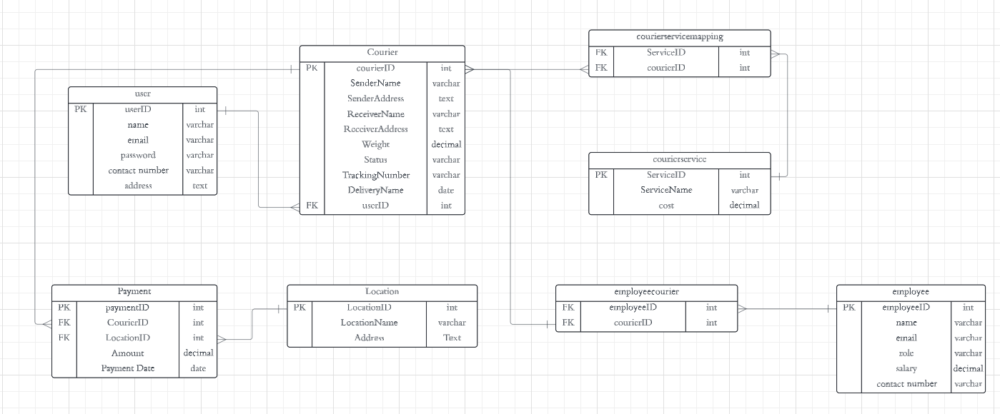

--TASK 1
--CREATE,INSERT

```sql
    CREATE TABLE [user]
    (UserID INT PRIMARY KEY, 
    Name VARCHAR(255), 
    Email VARCHAR(255) UNIQUE, 
    Password VARCHAR(255), 
    ContactNumber VARCHAR(20), 
    Address TEXT 
    );

    INSERT INTO [user](userID,name,email,Password,ContactNumber,Address)VALUES
    (100,'akash','akash04@gamil.com','AKASH123',7865433787,'tambaram'),
    (101,'seetha','seethasugumar@gmail.com','Seetha387',7747294659,'namakkal'),
    (102,'indira','indiraselvam@gmail.com','Indiras421','9845353781','tirupur'),
    (103,'aravind','aravindarav@gmail.com','arav@32','8748684468','Kanyakumari');
```

```sql
    CREATE TABLE Courier 
    (CourierID INT PRIMARY KEY,
    UserID int ,
    SenderName VARCHAR(255), 
    SenderAddress TEXT, 
    ReceiverName VARCHAR(255), 
    ReceiverAddress TEXT, 
    Weight DECIMAL, 
    Status VARCHAR(50), 
    TrackingNumber VARCHAR(20) UNIQUE, 
    DeliveryDate DATE,
    FOREIGN KEY (UserID) REFERENCES [User](UserID)); 


    INSERT INTO Courier(CourierID,userID,SenderName,SenderAddress,ReceiverName,ReceiverAddress,Weight,Status,
    TrackingNumber,DeliveryDate)
    VALUES(200,100,'Akash','Tambaram','Senthur','Vilupuram',5,'dispatched',77457644827,'2024-05-02'),
    (202,101,'Seetha','Namakkal','Veera','Vellore',3.5,'on the way',77457743891,'2024-04-29'),
    (205,102,'Indira','Tirupur','Senthil','Trivandrum',7,'delivered',57457244807,'2024-04-22'),
    (207,103,'Aravind','Kanyakumari','Trishna','Salem',6.15,'reached the nearest hub',95757624828,'2024-05-01'),
    (208,102,'Indira','Tirupur','Manoj','Thuraiyur',4.25,'delivered',57457244817,'2024-05-23'),
    (201,100,'Akash','Tambaram','Senthur','London',5,'dispatched',77457644857,'2024-05-10');
```


```sql
    CREATE TABLE  CourierServices 
    (ServiceID INT PRIMARY KEY, 
    ServiceName VARCHAR(100), 
    Cost DECIMAL);

    INSERT INTO CourierServices(ServiceID,ServiceName,Cost)VALUES
    (001,'STANDARD SHIPPING',70),
    (002,'EXPRESS SHIPPING',140),
    (003,'SAME DAY DELIVERY',210),
    (004,'INTERNATIONAL',1050);
```


```sql
    CREATE TABLE CourierServiceMapping (
            CourierID INT,
            ServiceID INT,
            FOREIGN KEY (CourierID) REFERENCES Courier(CourierID),
            FOREIGN KEY (ServiceID) REFERENCES CourierServices(ServiceID)
        );

    INSERT INTO CourierServiceMapping(CourierID,ServiceID)VALUES
    (200,001),(202,001),(205,003),(207,001),(208,003),(201,004);
```sql


```sql
    CREATE TABLE Employee
    (EmployeeID INT PRIMARY KEY, 
    Name VARCHAR(255), 
    Email VARCHAR(255) UNIQUE, 
    ContactNumber VARCHAR(20), 
    Role VARCHAR(50), 
    Salary DECIMAL);

    INSERT INTO Employee(EmployeeID,Name,Email,ContactNumber,Role,Salary)VALUES
    (7001,'Suresh','SureshChakravarty@gmail.com',9088333557,'Supply Chain Analyst',40000),
    (7005,'Vinay','Vinay04@gmail.com',9188333333,'Transportation Manager',24000),
    (7006,'Bhavani John','Bhavanijohn@gmail.com',8537454888,'Customs Broker',18000),
    (7007,'Krithika','Krithikasubash@gmail.com',7246624999,'Logistics Engineer',35000),
    (7008,'John','johnkenedy@gmail.com',9047435139,'Delivery specialist',20000),
    (7009,'Naveen','naveenv@gmail.com',9947435139,'Delivery specialist',20000);
```

```sql
    CREATE TABLE EmployeeCourier (
            EmployeeID INT,
            CourierID INT,
            FOREIGN KEY (EmployeeID) REFERENCES Employee(EmployeeID),
            FOREIGN KEY (CourierID) REFERENCES Courier(CourierID)
        );

    INSERT INTO EmployeeCourier(EmployeeID,CourierID)VALUES
    (7001,200),(7005,202),(7006,205),(7007,207),(7009,208),(7008,201);
```

```sql
    CREATE TABLE Location 
    (LocationID INT PRIMARY KEY, 
    LocationName VARCHAR(100), 
    Address TEXT);

    INSERT INTO Location(LocationID,LocationName,Address)VALUES
    (31838,'Vinayagar street','vilupuram'),
    (21764,'jolarpet','vellore'),
    (52838,'Varkala','Trivandrum'),
    (23176,'omalur','salem'),
    (53883,'kamarajar street','thuraiyur'),
    (67376,'Grrenwich','Londan');
    select * from Location
```


```sql
    CREATE TABLE payment
    (PaymentID INT PRIMARY KEY, 
    CourierID INT, 
    LocationId INT, 
    Amount DECIMAL, 
    PaymentDate DATE, 
    FOREIGN KEY (CourierID) REFERENCES Courier(CourierID), 
    FOREIGN KEY (LocationID) REFERENCES Location(LocationID));

    INSERT INTO payment(PaymentID,CourierID,LocationId,Amount,PaymentDate)VALUES
    (0001,200,31838,70,'2024-04-25'),
    (0002,202,21764,85,'2024-04-24'),
    (0004,205,52838,240,'2024-04-22'),
    (0005,207,23176,75,'2024-04-27'),
    (0006,208,53883,240,'2024-04-25'),
    (0007,201,67376,2500,'2024-04-23');
    select * from payment
```

--TASK 2
--SELECT,WHERE
--1
-- List all customers: 
```sql
    SELECT senderName FROM Courier;
```
--2
--List all orders for a specific customer:
```sql
    SELECT courierID FROM Courier
    WHERE SenderName='Akash';
```
--3
-- List all couriers: 
```sql
    SELECT * FROM Courier;
```
--4
--List all packages for a specific order: 
```sql
    SELECT * FROM CourierServices;
```
--5
--List all deliveries for a specific courier:
```sql
    SELECT receiverName,ReceiverAddress FROM Courier
    WHERE CourierID=200;
```
--6
--List all undelivered packages:
```sql
    SELECT status FROM Courier
    where status <> 'delivered';
```
--7
--List all packages that are scheduled for delivery today:
```sql
    SELECT Status FROM Courier
    WHERE DeliveryDate =CAST( GETDATE() AS date);
```
--8
--List all packages with a specific status:
```sql
    SELECT ReceiverName,Status FROM Courier
    WHERE Status='reached the nearest hub'; 
```
--9
--Calculate the total number of packages for each courier. 
```sql
    SELECT sendername,count(courierID) FROM Courier
    GROUP BY SenderName;
```
--10
-- Find the average delivery time for each courier
```sql
    SELECT avg(datediff(day,'2024-04-27',deliverydate))FROM Courier
    GROUP BY CourierID;
```
--11
-- List all packages with a specific weight range:
```sql
    SELECT weight FROM Courier
    WHERE Weight=5;
```
--12
--Retrieve employees whose names contain 'John' 
```sql
    SELECT name FROM Employee
    WHERE name like '%john%';
```
--13
-- Retrieve all courier records with payments greater than $50. 
```sql
    SELECT amount FROM payment
    WHERE Amount>100;
```

--TASK 3
--14
-- Find the total number of couriers handled by each employee. 
```sql
    SELECT employeeID,count(*) FROM employee
    GROUP BY EmployeeID;
```
--15
--Calculate the total revenue generated by each location 
```sql
    SELECT locationID,sum(amount) FROM payment
    GROUP BY LocationID;
```
--16
-- Find the total number of couriers delivered to each location
```sql
    SELECT LocationID, COUNT(CourierID) AS TotalDeliveries
    FROM payment
    GROUP BY LocationID;
```
--17
--Find the courier with the highest average delivery time: 
```sql
    SELECT TOP 1 courierID,avg(datediff(day,'2024-04-27',deliverydate))
    FROM Courier
    GROUP BY CourierID
    ORDER BY avg(datediff(day,'2024-04-27',deliverydate)) DESC;
```
--18
-- Find Locations with Total Payments Less Than a Certain Amount 
```sql
    SELECT locationID,amount from payment
    WHERE amount>200;
```
--19
-- Calculate Total Payments per Location 
```sql
    SELECT locationID , sum(amount) FROM payment
    GROUP BY LocationId;
```
--20
--Retrieve couriers who have received payments totaling more than $1000 in a specific location (LocationID = X): 
```sql
    SELECT c.CourierID, c.SenderName, SUM(p.Amount) AS TotalPayments
    FROM courier c
    JOIN payment p ON c.CourierID = p.CourierID
    WHERE p.LocationID = 52838
    GROUP BY c.CourierID, c.SenderName
    HAVING SUM(p.Amount) > 1000;
```
--21
--Retrieve couriers who have received payments totaling more than $1000 after a certain date (PaymentDate > 'YYYY-MM-DD'): 
```sql
    SELECT CourierID, SUM(Amount) AS TotalPayment
    FROM Payment
    WHERE PaymentDate > '2024-04-22'
    GROUP BY CourierID
    HAVING SUM(Amount) > 1000;
```
--22
--Retrieve locations where the total amount received is more than $5000 before a certain date (PaymentDate > 'YYYY-MM-DD') 
```sql
    SELECT l.LocationID, l.LocationName, SUM(p.Amount) AS TotalAmountReceived
    FROM location l
    JOIN payment p ON l.LocationID = p.LocationID
    WHERE p.PaymentDate > '2024-04-22'
    GROUP BY l.LocationID, l.LocationName
    HAVING SUM(p.Amount) > 80;
```

--Task 3
--23
--Retrieve Payments with Courier Information
```sql
    SELECT p.PaymentID, p.Amount, p.PaymentDate, c.CourierID, c.sendername
    FROM payment p
    JOIN courier c ON p.CourierID = c.CourierID;
```
--24
--Retrieve Payments with Location Information
```sql
    SELECT p.PaymentID, p.Amount, p.PaymentDate, l.LocationID, l.LocationName
    FROM payment p
    JOIN location l ON p.LocationID = l.LocationID;
```
--25
--Retrieve Payments with Courier and Location Information
```sql
    SELECT p.PaymentID, p.Amount, p.PaymentDate, c.CourierID, c.sendername, l.LocationID, l.LocationName
    FROM payment p
    JOIN courier c ON p.CourierID = c.CourierID
    JOIN location l ON p.LocationID = l.LocationID;
```
--26
--List all payments with courier details
```sql
    SELECT p.PaymentID, p.Amount, p.PaymentDate, c.CourierID, c.SenderName
    FROM payment p
    JOIN courier c ON p.CourierID = c.CourierID;
```
--27
--Total payments received for each courier
```sql
    SELECT c.CourierID, c.SenderName, SUM(p.Amount) AS TotalPaymentsReceived
    FROM courier c
    JOIN payment p ON c.CourierID = p.CourierID
    GROUP BY c.CourierID, c.SenderName;
```
--28
--List payments made on a specific date
```sql
    SELECT * FROM payment
    WHERE PaymentDate = '2024-04-25';
```
--29
--Get Courier Information for Each Payment
```sql
    SELECT p.PaymentID, p.Amount, p.PaymentDate, c.CourierID, c.SenderName
    FROM payment p
    JOIN courier c ON p.CourierID = c.CourierID;
```
--30
--Get Payment Details with Location 
```sql
    SELECT p.PaymentID, p.Amount, p.PaymentDate, l.LocationID, l.LocationName
    FROM payment p
    JOIN location l ON p.LocationID = l.LocationID;
```
--31
--Calculating Total Payments for Each Courier 
```sql
    SELECT c.CourierID, c.SenderName, SUM(p.Amount) AS TotalPayments
    FROM courier c
    JOIN payment p ON c.CourierID = p.CourierID
    GROUP BY c.CourierID, c.SenderName;
```
--32
--List Payments Within a Date Range 
```sql
    SELECT * FROM payment
    WHERE PaymentDate >= '2024-04-24' AND PaymentDate <= '2024-04-26';
```
--33
--Retrieve a list of all users and their corresponding courier records, including cases where there are no matches on either side
```sql
    SELECT U.UserID, U.Name, C.CourierID
    FROM [User] U
    LEFT JOIN Courier C ON U.UserID = C.UserID;
```
--34
--Retrieve a list of all couriers and their corresponding services, including cases where there are no matches on either side 
```sql
    SELECT C.CourierID, C.SenderName,CS.ServiceID, CS.ServiceName
    FROM courier C
    LEFT JOIN courierservicemapping CSM ON C.CourierID = CSM.CourierID
    LEFT JOIN courierservices CS ON CSM.ServiceID = CS.ServiceID;
```
--35
--Retrieve a list of all employees and their corresponding payments, including cases where there are no matches on either side 
```sql
    SELECT E.EmployeeID, E.Name,P.PaymentID, P.Amount
    FROM employee E
    LEFT JOIN employeecourier EC ON E.EmployeeID = EC.EmployeeID
    LEFT JOIN payment P ON EC.CourierID = P.CourierID;
```
--36
--List all users and all courier services, showing all possible combinations
```sql
    SELECT u.UserID, u.Name, c.CourierID, c.SenderName, s.ServiceID, s.ServiceName
    FROM [user] u
    CROSS JOIN courier c
    CROSS JOIN CourierServices s;
```
--37
-- List all employees and all locations, showing all possible combinations:
```sql
    SELECT e.EmployeeID, e.Name, l.LocationID, l.LocationName
    FROM employee e
    CROSS JOIN location l;
```
--38
-- Retrieve a list of couriers and their corresponding sender information (if available) 
```sql
    SELECT CourierID , sendername FROM Courier;
```
--39
-- Retrieve a list of couriers and their corresponding receiver information (if available):
```sql
    SELECT CourierID , ReceiverName FROM Courier;
```
--40
-- Retrieve a list of couriers along with the courier service details (if available): 
```sql
    SELECT  C.CourierID, C.senderName,CSM.ServiceID, CS.ServiceName
    FROM courier C
    LEFT JOIN courierservicemapping CSM ON C.CourierID = CSM.CourierID
    LEFT JOIN CourierServices CS ON CSM.ServiceID = CS.ServiceID;
```
--41
-- Retrieve a list of employees and the number of couriers assigned to each employee:
```sql
SELECT E.EmployeeID, E.Name, COUNT(EC.CourierID) AS AssignedCouriers
FROM employee E
LEFT JOIN employeecourier EC ON E.EmployeeID = EC.EmployeeID
LEFT JOIN Courier c ON EC.CourierID=c.CourierID
GROUP BY E.EmployeeID, E.Name;
```
--42
--Retrieve a list of locations and the total payment amount received at each location: 
```sql
    SELECT L.LocationID, L.LocationName,SUM(P.Amount) AS TotalPaymentAmount
    FROM Location L
    JOIN Payment P ON L.LocationID = P.LocationID
    GROUP BY L.LocationID, L.LocationName;
```
--43
--Retrieve all couriers sent by the same sender (based on SenderName)
```sql
    SELECT c1.CourierID, c1.SenderName
    FROM courier c1
    JOIN courier c2 ON c1.SenderName = c2.SenderName
    WHERE c1.CourierID != c2.CourierID;
```
--44
--List all employees who share the same role.
```sql
    SELECT EmployeeID, Name, Role
    FROM employee
    WHERE Role IN (
        SELECT Role
        FROM employee
        GROUP BY Role
        HAVING COUNT(*) > 1
    );
```
--45
--Retrieve all payments made for couriers sent from the same location. 
```sql
SELECT P.PaymentID, P.Amount, P.PaymentDate,C.CourierID,
L.LocationID, L.LocationName
FROM Payment P
JOIN Courier C ON P.CourierID = C.CourierID
JOIN Location L ON P.LocationID = L.LocationID
JOIN Payment P2 ON P.CourierID = P2.CourierID AND P.LocationID = P2.LocationID
ORDER BY p.PaymentDate;
```

--46
--Retrieve all couriers sent from the same location (based on SenderAddress).
```sql
    SELECT c1.CourierID, c1.SenderName, c1.SenderAddress
    FROM courier c1
    JOIN courier c2 ON c1.SenderAddress LIKE c2.SenderAddress
    WHERE c1.CourierID != c2.CourierID;
```
--47
-- List employees and the number of couriers they have delivered:
```sql
    SELECT E.EmployeeID,E.Name,COUNT(EC.CourierID) AS DeliveredCouriers
    FROM employee E
    LEFT JOIN employeecourier EC ON E.EmployeeID = EC.EmployeeID
    GROUP BY E.EmployeeID,E.Name;
```

--48
-- Find couriers that were paid an amount greater than the cost of their respective courier services
```sql
    SELECT p.courierID from payment p
    inner join CourierServiceMapping cs on p.CourierID=cs.CourierID
    inner join CourierServices c on cs.ServiceID=c.ServiceID
    where Amount>Cost;
```

--scope
--49
--Find couriers that have a weight greater than the average weight of all couriers
```sql
    SELECT CourierID, SenderName, Weight
    FROM courier
    WHERE Weight > (SELECT AVG(Weight) FROM courier);
```
--50
--Find the names of all employees who have a salary greater than the average salary: 
```sql
    SELECT Name
    FROM employee
    WHERE Salary > (SELECT AVG(Salary) FROM employee);
```
--51
--Find the total cost of all courier services where the cost is less than the maximum cost
```sql
    SELECT SUM(Cost) AS TotalCost
    FROM CourierServices
    WHERE Cost < (SELECT MAX(Cost) FROM CourierServices);
```
--52
--Find all couriers that have been paid for
```sql
    select courierid , amount from payment
    where Amount is not null; 
```
--53
--Find the locations where the maximum payment amount was made
```sql
    SELECT * from location 
    where LocationID =(SELECT locationID from payment
    where amount =(select max(amount) from payment));
```

--54
--Find all couriers whose weight is greater than the weight of all couriers sent by a specific sender (e.g., 'SenderName'):
```sql
    SELECT CourierID, SenderName, Weight
    FROM courier
    WHERE Weight > (
        SELECT MAX(Weight)
        FROM courier
        WHERE SenderName = 'Akash'
    );
```



